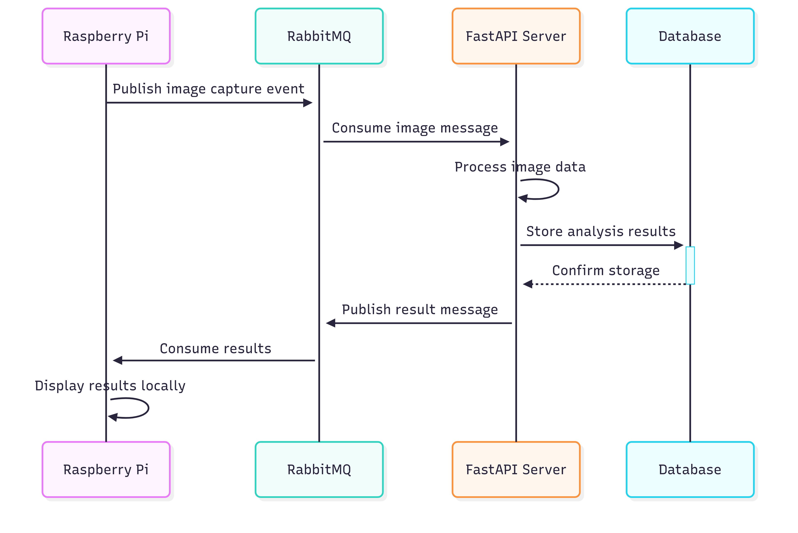
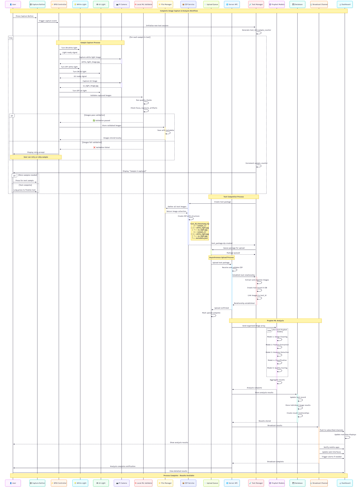
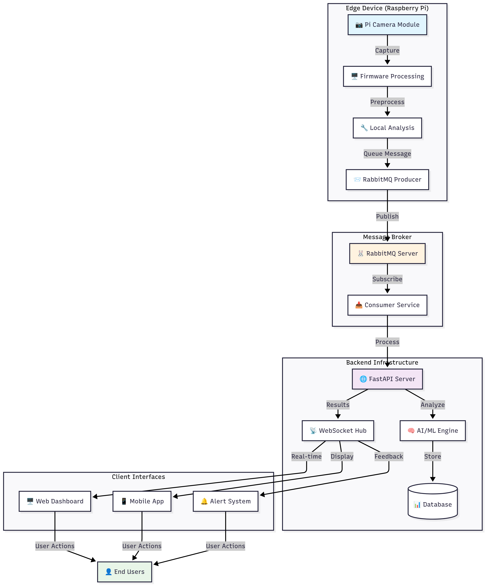
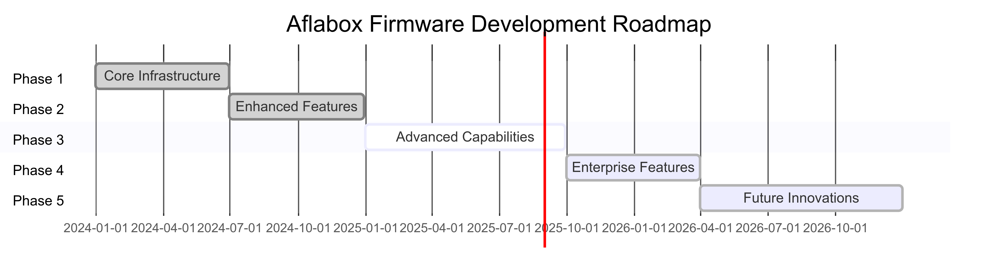

<div id="top">

<!-- HEADER STYLE: CLASSIC -->
<div align="center">


# <code>❯ Aflabox Firmware</code>

<em>Client–Server image capture and instant result display system with RabbitMQ realtime messaging</em>

[](https://choosealicense.com/licenses/mit/)
[](https://www.python.org/downloads/)
[](https://fastapi.tiangolo.com)
[](https://rabbitmq.com)

---

### Built With


</div>
<br>

---

## 📋 Table of Contents

- [🔎 Overview](#overview)
- [🏗️ Architecture Flow](#architecture-flow)
- [🏗️ Device Image capture Flow](#device-image-capture-flow)
- [✨ Features](#features)
- [📁 Project Structure](#project-structure)
- [🚀 Getting Started](#getting-started)
- [🐰 RabbitMQ Setup & Integration](#rabbitmq-setup--integration)
- [📤 Remote Upload Options](#remote-upload-options)
- [🧪 Testing](#testing)
- [🗺️ Roadmap](#roadmap)
- [🤝 Contributing](#contributing)
- [📜 License](#license)
- [🙏 Acknowledgments](#acknowledgments)

---

## 🔎 Overview

This firmware transforms a **Raspberry Pi** into an intelligent edge device that captures images under various lighting conditions, processes them locally, and seamlessly communicates with a central server backend through **RabbitMQ real-time messaging**. The system provides instant analysis results displayed on connected screens or web dashboards.

### 🎯 Key Value Propositions

- **Real-time Processing**: Sub-second image capture, analysis, and result delivery
- **Edge Intelligence**: Local preprocessing reduces bandwidth and latency
- **Scalable Architecture**: Support for multiple Pi devices in distributed networks
- **Reliable Messaging**: RabbitMQ ensures message delivery and system resilience
- **Instant Feedback**: Live display of analysis results for immediate decision-making

### 🏭 Use Cases

- **Agricultural Monitoring**: Corn Quality and aflatoxin infestation assessment and environmental tracking

---

## 🏗️ Architecture Flow

<div align="center">
  
  <p><em>Architecture Flow</em></p>
</div>

---

---

## 🏗️ Device Image capture Flow

<div align="center">
  
  <p><em>Device Image capture Flow</em></p>
</div>

---

## ✨ Features

<table>
<tr>
<th>🔧 Component</th>
<th>📋 Features</th>
<th>📝 Details</th>
</tr>
<tr>
<td><strong>🏗️ Architecture</strong></td>
<td>Microservices Design</td>
<td>Async communication via WebSockets, RabbitMQ message queuing, REST API integration</td>
</tr>
<tr>
<td><strong>🔩 Code Quality</strong></td>
<td>Production Ready</td>
<td>Black formatting, comprehensive <code>pytest</code> coverage, type hints, linting</td>
</tr>
<tr>
<td><strong>📄 Documentation</strong></td>
<td>Developer Friendly</td>
<td>Inline comments, OpenAPI docs, structured README, architecture diagrams</td>
</tr>
<tr>
<td><strong>🔌 Integrations</strong></td>
<td>Multiple Protocols</td>
<td>FastAPI backend, FTP/SFTP/S3 upload, MQTT support, webhook notifications</td>
</tr>
<tr>
<td><strong>🧩 Modularity</strong></td>
<td>Separation of Concerns</td>
<td>Hardware abstraction, service isolation, plugin architecture, config management</td>
</tr>
<tr>
<td><strong>🧪 Testing</strong></td>
<td>Comprehensive Coverage</td>
<td>Unit tests, integration tests, hardware mocks, CI/CD pipeline ready</td>
</tr>
<tr>
<td><strong>⚡️ Performance</strong></td>
<td>High Throughput</td>
<td>Async I/O, connection pooling, efficient caching, optimized image processing</td>
</tr>
<tr>
<td><strong>🛡️ Security</strong></td>
<td>Enterprise Grade</td>
<td>JWT authentication, TLS encryption, input sanitization, secure key storage</td>
</tr>
<tr>
<td><strong>📦 Dependencies</strong></td>
<td>Well Managed</td>
<td>Pinned versions, security scanning, dependency graphs, automated updates</td>
</tr>
<tr>
<td><strong>🔄 Real-time</strong></td>
<td>Message Streaming</td>
<td>RabbitMQ pub/sub, WebSocket connections, event-driven architecture</td>
</tr>
</table>

---

## 📁 Project Structure

```text
raspberry-pi-firmware/
├── 📁 config/                     # Configuration files
│   ├── camera.ini                 # Camera settings and calibration
│   ├── logging.ini                # Logging configuration
│   ├── rabbitmq.ini               # RabbitMQ connection settings
│   └── system.ini                 # System-wide configurations
├── 📁 fonts/                      # Custom fonts for displays
│   ├── roboto-regular.ttf         # UI font family
│   └── mono-bold.ttf              # Monospace for logs
├── 📁 src/                        # Core firmware source code
│   ├── 📁 hardware/               # Hardware abstraction layer
│   │   ├── __init__.py
│   │   ├── camera.py              # Pi Camera interface
│   │   ├── display.py             # HDMI/LCD display controller
│   │   ├── gpio.py                # GPIO pin management
│   │   └── sensors.py             # Environmental sensors
│   ├── 📁 services/               # Business logic services
│   │   ├── __init__.py
│   │   ├── messaging.py           # RabbitMQ producer/consumer
│   │   ├── websocket_client.py    # WebSocket connectivity
│   │   ├── registration.py        # Device registration service
│   │   ├── health_monitor.py      # System health monitoring
│   │   └── upload_manager.py      # File upload orchestration
│   ├── 📁 utils/                  # Utility functions and helpers
│   │   ├── __init__.py
│   │   ├── caching.py             # Redis/memory caching
│   │   ├── image_processor.py     # Image manipulation utilities
│   │   ├── config_loader.py       # Configuration management
│   │   ├── logger.py              # Structured logging
│   │   └── security.py            # Encryption and validation
│   ├── 📁 db/                     # Database handlers
│   │   ├── __init__.py
│   │   ├── sqlite_manager.py      # Local SQLite operations
│   │   ├── migrations/            # Database schema migrations
│   │   └── models.py              # Database model definitions
│   ├── 📁 models/                 # Pydantic data models
│   │   ├── __init__.py
│   │   ├── device.py              # Device registration models
│   │   ├── image.py               # Image metadata models
│   │   ├── message.py             # RabbitMQ message schemas
│   │   └── response.py            # API response models
│   └── main.py                    # Application entrypoint
├── 📁 scripts/                    # Automation and deployment
│   ├── installer_global.sh        # Complete system installation
│   ├── manage_install.sh          # Deployment management
│   ├── setup_rabbitmq.sh          # RabbitMQ installation script
│   └── release.sh                 # Automated release operations
├── 📁 tests/                      # Comprehensive test suite
│   ├── __init__.py
│   ├── 📁 unit/                   # Unit tests
│   │   ├── test_camera.py
│   │   ├── test_messaging.py
│   │   └── test_utils.py
│   ├── 📁 integration/            # Integration tests
│   │   ├── test_end_to_end.py
│   │   └── test_rabbitmq.py
│   ├── 📁 fixtures/               # Test data and mocks
│   └── conftest.py                # Pytest configuration
├── 📁 docs/                       # Additional documentation
│   ├── api.md                     # API documentation
│   ├── deployment.md              # Deployment guide
│   └── troubleshooting.md         # Common issues and solutions
├── requirements.txt               # Python package dependencies
├── requirements-dev.txt           # Development dependencies
├── setup.py                       # Package installation script
├── pyproject.toml                 # Project metadata and tools
├── .env.example                   # Environment variables template
├── docker-compose.yml             # Local development stack
└── README.md                      # This documentation file
```

---

## 🚀 Getting Started

### 📋 Prerequisites

Before installation, ensure your system meets these requirements:

- **Hardware**: Raspberry Pi 2W or Raspberry Pi 5(4GB+ recommended)
- **OS**: Raspberry Pi OS (64-bit) or Ubuntu 22.04+ for ARM64
- **Python**: Version 3.9 or higher
- **Memory**: Minimum 2GB RAM (4GB+ recommended)
- **Storage**: 16GB+ microSD card (Class 10 or better)
- **Camera**: ArduCam 16/64MP Autofocus Camera but also works with Raspberry Pi Camera Module v2/v3
- **Network**: WiFi connection

### 🔧 System Preparation

<details>
<summary><strong>📱 Raspberry Pi Initial Setup</strong></summary>

1. **Flash Raspberry Pi OS**:

   ```bash
   # Download Raspberry Pi Imager
   # Flash 64-bit Raspberry Pi OS to microSD card
   # Enable SSH and configure WiFi during imaging
   ```

2. **Update system packages**:

   ```bash
   sudo apt update && sudo apt upgrade -y
   sudo apt install -y git python3-pip python3-venv
   ```

3. **Enable SPI and UART (for NEO-6M GPS)**:
   ```bash
   sudo raspi-config
    # Navigate to: Interface Options > SPI > Enable
    # Navigate to: Interface Options > Serial Port > Enable (disable shell login over serial, enable serial hardware)
   sudo reboot
   ```

</details>

### 📦 Installation

#### Method 1: Automated Installation (Recommended)

```bash
# Clone the repository
git clone https://github.com/aflabox/aflabox-firmware.git
cd raspberry-pi-firmware

# Make installation script executable
chmod +x scripts/installer_global.sh

# Run automated installation
sudo ./scripts/installer_global.sh
```

#### Method 2: Manual Installation

<details>
<summary><strong>🔧 Step-by-Step Manual Setup</strong></summary>

1. **Clone and setup environment**:

   ```bash
   git clone https://github.com/aflabox/aflabox-firmware.git
   cd raspberry-pi-firmware

   # Create virtual environment
   python3 -m venv venv
   source venv/bin/activate
   ```

2. **Install Python dependencies**:

   ```bash
   # Production dependencies
   pip install -r requirements.txt

   # Development dependencies (optional)
   pip install -r requirements-dev.txt
   ```

3. **Configure environment variables**:

   ```bash
   # Copy environment template
   cp .env.example .env

   # Edit configuration
   nano .env
   ```

4. **Setup database**:
   ```bash
   # Initialize SQLite database
   python src/db/migrations/init_db.py #Obsolute from Version 2
   ```

</details>

### ⚙️ Configuration

<details>
<summary><strong>📝 Configuration Files Setup</strong></summary>

1. **Camera Configuration** (`config/camera.ini`):

   ```ini
   [camera]
   resolution_width = 1920
   resolution_height = 1080
   framerate = 30
   iso = 400
   exposure_mode = auto
   white_balance = auto

   [capture]
   format = jpeg
   quality = 85
   burst_mode = false
   ```

2. **RabbitMQ Configuration** (`config/rabbitmq.ini`):

   ```ini
   [connection]
   host = localhost
   port = 5672
   username = pi_user
   password = secure_password
   virtual_host = /

   [queues]
   image_queue = pi_images
   result_queue = pi_results
   heartbeat_queue = pi_heartbeat
   ```

3. **System Configuration** (`config/system.ini`):

   ```ini
   [device]
   device_id = pi_001
   location = production_line_1
   description = Quality Control Camera

   [upload]
   method = rabbitmq
   backup_method = ftp
   retry_attempts = 3
   ```

</details>

---

## 🐰 RabbitMQ Setup & Integration

### 📦 RabbitMQ Installation

<details>
<summary><strong>🔧 Install RabbitMQ Server</strong></summary>

#### On Aflabox Server (Server Installation)

```bash
# Update package lists
sudo apt update

# Install RabbitMQ
sudo apt install -y rabbitmq-server

# Enable and start RabbitMQ service
sudo systemctl enable rabbitmq-server
sudo systemctl start rabbitmq-server

# Check service status
sudo systemctl status rabbitmq-server
```

#### Using Docker (Alternative)

```bash
# Pull and run RabbitMQ with management plugin
docker run -d \
  --name rabbitmq \
  -p 5672:5672 \
  -p 15672:15672 \
  -e RABBITMQ_DEFAULT_USER=pi_user \
  -e RABBITMQ_DEFAULT_PASS=secure_password \
  rabbitmq:3-management
```

</details>

### 🔧 RabbitMQ Configuration

<details>
<summary><strong>⚙️ Setup Users and Permissions</strong></summary>

```bash
# Access RabbitMQ management
sudo rabbitmqctl add_user pi_user secure_password
sudo rabbitmqctl set_user_tags pi_user administrator
sudo rabbitmqctl set_permissions -p / pi_user ".*" ".*" ".*"

# Enable management plugin
sudo rabbitmq-plugins enable rabbitmq_management

# Create virtual host (optional)
sudo rabbitmqctl add_vhost pi_environment
sudo rabbitmqctl set_permissions -p pi_environment pi_user ".*" ".*" ".*"
```

**Access Management Interface**: `http://your-pi-ip:15672`

- Username: `pi_user`
- Password: `secure_password`

</details>

### 🔄 Integration Verification

<details>
<summary><strong>✅ Test RabbitMQ Connection</strong></summary>

Run the built-in connection test:

```bash
# Test RabbitMQ connectivity
python src/services/messaging.py --test

# Expected output:
# ✅ RabbitMQ connection successful
# ✅ Queue 'pi_images' created
# ✅ Test message sent and received
```

Manual verification:

```python
# Quick connection test
from src.services.messaging import RabbitMQService

async def test_connection():
    service = RabbitMQService()
    await service.connect()
    print("✅ RabbitMQ connected successfully")
    await service.disconnect()

# Run test
import asyncio
asyncio.run(test_connection())
```

</details>

### 📨 Message Flow Architecture

<div align="center">
  
  <p><em>Message flow between Raspberry Pi, RabbitMQ, and FastAPI Server</em></p>
</div>

---

## 📤 Remote Upload Options

### 🔄 Option 1: rsync Upload (Recommended)

<details>
<summary><strong>📡 Automated Sync with rsync</strong></summary>

#### Basic Upload

```bash
# Sync entire project to Raspberry Pi
rsync -avz --progress ./ pi@<raspberry_pi_ip>:/home/pi/aflabox-firmware/

# Sync with deletion of remote files not present locally
rsync -avz --progress --delete ./ pi@<raspberry_pi_ip>:/home/pi/aflabox-firmware/
```

#### Advanced rsync Options

```bash
# Exclude unnecessary files
rsync -avz --progress \
  --exclude='.git' \
  --exclude='__pycache__' \
  --exclude='*.pyc' \
  --exclude='venv' \
  --exclude='.pytest_cache' \
  ./ pi@<raspberry_pi_ip>:/home/pi/aflabox-firmware/

# Dry run (preview changes)
rsync -avz --progress --dry-run ./ pi@<raspberry_pi_ip>:/home/pi/aflabox-firmware/
```

#### Automated Deployment Script

Create `scripts/deploy.sh`:

```bash
#!/bin/bash
set -e

PI_IP="192.168.1.100"  # Replace with your Pi's IP
PI_USER="pi"
PROJECT_PATH="/home/pi/aflabox-firmware"

echo "🚀 Deploying to Raspberry Pi..."

# Sync files
rsync -avz --progress \
  --exclude-from='.deployignore' \
  ./ $PI_USER@$PI_IP:$PROJECT_PATH/

# Restart services on Pi
ssh $PI_USER@$PI_IP "cd $PROJECT_PATH && sudo systemctl restart pi-firmware"

echo "✅ Deployment completed successfully!"
```

</details>

### 📁 Option 2: FTP Upload

<details>
<summary><strong>📤 FTP Server Setup and Usage</strong></summary>

#### Setup FTP Server

```bash
# Install FTP server
sudo apt install -y vsftpd

# Configure FTP
sudo nano /etc/vsftpd.conf

# Key configuration changes:
# write_enable=YES
# local_enable=YES
# chroot_local_user=YES

# Restart FTP service
sudo systemctl restart vsftpd
sudo systemctl enable vsftpd
```

#### Upload via FTP

```bash
# Using built-in FTP client
ftp <raspberry_pi_ip>
# Login with pi user credentials
# cd /home/pi/aflabox-firmware/
# put -r ./src
# quit

# Using lftp (more features)
lftp -u pi,password <raspberry_pi_ip>
lcd /path/to/local/project
cd /home/pi/aflabox-firmware
mirror --reverse --verbose --exclude-glob=__pycache__
quit
```

#### Automated FTP Deployment

```bash
#!/bin/bash
# scripts/ftp_deploy.sh

PI_IP="192.168.1.100"
FTP_USER="pi"
FTP_PASS="your_password"

lftp -c "
set ftp:ssl-allow no;
open ftp://$FTP_USER:$FTP_PASS@$PI_IP;
lcd $(pwd);
cd /home/pi/aflabox-firmware;
mirror --reverse --delete --verbose --exclude-glob=__pycache__ --exclude-glob=.git;
quit
"
```

</details>

### ☁️ Option 3: Cloud Storage Integration

<details>
<summary><strong>🌥️ S3/Cloud Upload</strong></summary>

Configure cloud storage for backup and synchronization:

```python
# src/services/cloud_sync.py
import boto3
from src.utils.config_loader import load_config

class CloudSync:
    def __init__(self):
        config = load_config('cloud')
        self.s3_client = boto3.client(
            's3',
            aws_access_key_id=config['aws_access_key'],
            aws_secret_access_key=config['aws_secret_key']
        )

    async def sync_images(self, local_path: str, bucket: str):
        """Sync local images to S3 bucket"""
        # Implementation here
        pass
```

Usage:

```bash
# Configure AWS credentials
aws configure

# Sync images to cloud
python -c "from src.services.cloud_sync import CloudSync; CloudSync().sync_images('./images', 'pi-images-bucket')"
```

</details>

---

## 🧪 Testing

### 🏃‍♂️ Running Tests

<details>
<summary><strong>⚡ Quick Test Commands</strong></summary>

```bash
# Run all tests
pytest

# Run with coverage report
pytest --cov=src --cov-report=html

# Run specific test categories
pytest tests/unit/          # Unit tests only
pytest tests/integration/   # Integration tests only

# Run tests with verbose output
pytest -v

# Run tests matching pattern
pytest -k "test_camera"

# Run tests and stop on first failure
pytest -x
```

</details>

### 🔧 Test Configuration

<details>
<summary><strong>⚙️ Test Setup and Mocking</strong></summary>

#### Hardware Mocking for Development

```python
# tests/conftest.py
import pytest
from unittest.mock import MagicMock

@pytest.fixture
def mock_camera():
    """Mock camera hardware for testing"""
    camera = MagicMock()
    camera.capture.return_value = b"fake_image_data"
    camera.resolution = (1920, 1080)
    return camera

@pytest.fixture
def mock_rabbitmq():
    """Mock RabbitMQ for testing"""
    rmq = MagicMock()
    rmq.publish.return_value = True
    rmq.consume.return_value = {"status": "success"}
    return rmq
```

#### Environment Variables for Testing

```bash
# .env.test
TESTING=true
RABBITMQ_HOST=localhost
RABBITMQ_PORT=5672
DATABASE_URL=sqlite:///test.db
LOG_LEVEL=DEBUG
```

</details>

### 📊 Test Coverage

<details>
<summary><strong>📈 Coverage Reports and Metrics</strong></summary>

```bash
# Generate detailed coverage report
pytest --cov=src --cov-report=html --cov-report=term

# Coverage configuration in pyproject.toml
[tool.coverage.run]
source = ["src"]
omit = [
    "*/tests/*",
    "*/venv/*",
    "*/__pycache__/*"
]

[tool.coverage.report]
exclude_lines = [
    "pragma: no cover",
    "def __repr__",
    "raise AssertionError",
    "raise NotImplementedError"
]
```

View HTML coverage report: `open htmlcov/index.html`

**Target Coverage**: 90%+ for production code

</details>

### 🔍 Integration Testing

<details>
<summary><strong>🔄 End-to-End Test Scenarios</strong></summary>

```python
# tests/integration/test_full_workflow.py
import pytest
import asyncio
from src.main import FirmwareApp

@pytest.mark.asyncio
async def test_complete_image_workflow():
    """Test entire image capture to result display workflow"""
    app = FirmwareApp()

    # Test image capture
    image_data = await app.capture_image()
    assert image_data is not None

    # Test message publishing
    result = await app.publish_to_queue(image_data)
    assert result["status"] == "published"

    # Test result consumption
    analysis_result = await app.consume_results()
    assert "analysis" in analysis_result

    # Test display update
    display_updated = await app.update_display(analysis_result)
    assert display_updated is True
```

</details>

---

## 🗺️ Roadmap

### ✅ Completed Features

<details>
<summary><strong>📋 Phase 1 - Core Infrastructure (Completed)</strong></summary>

- [x] **Raspberry Pi Hardware Integration**

  - [x] Camera module interface (v2/v3 support)
  - [x] GPIO pin management and control
  - [x] Display output (HDMI/DSI/SPI)
  - [x] Environmental sensor integration

- [x] **RabbitMQ Messaging System**

  - [x] Async producer/consumer implementation
  - [x] Message serialization and validation
  - [x] Connection pooling and retry logic
  - [x] Dead letter queue handling

- [x] **FastAPI Backend Integration**

  - [x] RESTful API endpoints
  - [x] WebSocket real-time communication
  - [x] Request/response validation
  - [x] OpenAPI documentation

- [x] **Security Implementation**
  - [x] JWT token authentication
  - [x] TLS/SSL encryption
  - [x] Input sanitization and validation
  - [x] Secure configuration management

</details>

<details>
<summary><strong>📋 Phase 2 - Enhanced Features (Completed)</strong></summary>

- [x] **Database Management**

  - [x] SQLite local storage
  - [x] Database migrations system
  - [x] Connection pooling
  - [x] Backup and recovery

- [x] **Monitoring and Logging**

  - [x] Structured logging system
  - [x] Health check endpoints
  - [x] Performance metrics collection
  - [x] Error tracking and alerts

- [x] **Testing Framework**

  - [x] Unit test suite with mocking
  - [x] Integration test scenarios
  - [x] Hardware simulation for testing
  - [x] CI/CD pipeline integration

- [x] **Documentation**
  - [x] Comprehensive README
  - [x] API documentation
  - [x] Deployment guides
  - [x] Troubleshooting resources

</details>

### 🚧 In Progress

<details>
<summary><strong>📋 Phase 3 - Advanced Capabilities (Q4 2025)</strong></summary>

- [ ] **Multi-Device Orchestration** (80% complete)

  - [x] Device discovery and registration
  - [x] Centralized configuration management
  - [ ] Load balancing across devices
  - [ ] Coordinated batch processing
  - [ ] Device health monitoring dashboard

- [ ] **Edge AI Integration** (60% complete)

  - [x] TensorFlow Lite model deployment
  - [x] OpenCV image processing pipeline
  - [ ] Custom model training interface
  - [ ] Real-time inference optimization
  - [ ] Model versioning and updates

- [ ] **Advanced Analytics** (40% complete)
  - [x] Basic image analysis metrics
  - [ ] Machine learning insights
  - [ ] Predictive maintenance alerts
  - [ ] Performance trend analysis
  - [ ] Custom dashboard widgets

</details>

### 🔮 Planned Features

<details>
<summary><strong>📋 Phase 4 - Enterprise Features (Q1 2026)</strong></summary>

- [ ] **Cloud Integration**

  - [ ] AWS IoT Core integration
  - [ ] Azure IoT Hub connectivity
  - [ ] Google Cloud IoT integration
  - [ ] Multi-cloud deployment options
  - [ ] Cloud-based model training

- [ ] **Advanced Security**

  - [ ] Hardware security module (HSM) support
  - [ ] Certificate-based authentication
  - [ ] Encrypted storage at rest
  - [ ] Audit trail and compliance reporting
  - [ ] Role-based access control (RBAC)

- [ ] **Industrial IoT Features**
  - [ ] OPC-UA protocol support
  - [ ] MQTT-SN for low-power devices
  - [ ] Time-series data optimization
  - [ ] Industrial protocol bridges
  - [ ] Real-time control integration

</details>

<details>
<summary><strong>📋 Phase 5 - Future Innovations (2026+)</strong></summary>

- [ ] **AI/ML Enhancements**

  - [ ] Federated learning implementation
  - [ ] AutoML pipeline integration
  - [ ] Neural architecture search (NAS)
  - [ ] Quantum computing readiness
  - [ ] Advanced computer vision models

- [ ] **Next-Gen Hardware Support**

  - [ ] Raspberry Pi 6 optimization
  - [ ] AI accelerator integration (Coral, Intel NCS)
  - [ ] 5G connectivity modules probably e-Sim
  - [ ] Advanced sensor fusion
  - [ ] Edge GPU computing

- [ ] **Scalability & Performance**

  - [ ] Kubernetes orchestration
  - [ ] Microservices architecture
  - [ ] Event-driven scaling
  - [ ] Global edge deployment
  - [ ] Performance optimization AI

- [ ] **Developer Experience**
  - [ ] Visual programming interface
  - [ ] No-code configuration tools
  - [ ] Advanced debugging tools
  - [ ] Performance profiling suite
  - [ ] Automated deployment pipelines

</details>

### 🎯 Milestone Timeline

<div align="center">
  
  <p><em>Milestone Timeline</em></p>
</div>

---

## 🚀 Running Instructions

### 🏃‍♂️ Quick Start

<details>
<summary><strong>⚡ Launch the Firmware</strong></summary>

```bash
# Activate virtual environment
source venv/bin/activate

# Start the firmware application
python src/main.py

# Alternative: Start with custom config
python src/main.py --config /path/to/custom/config.ini

# Start in debug mode
python src/main.py --debug --log-level DEBUG

# Start with specific device ID
python src/main.py --device-id pi_production_001
```

**Expected output:**

```
🚀 Aflabox Firmware v2.1.0 starting...
✅ Camera initialized successfully
✅ RabbitMQ connection established
✅ Database migrations completed
✅ WebSocket client connected
🎯 System ready - waiting for capture events...
```

</details>

### 🔧 Service Management

<details>
<summary><strong>📋 Systemd Service Configuration</strong></summary>

Create a systemd service for automatic startup:

```bash
# Create service file
sudo nano /etc/systemd/system/pi-firmware.service
```

```ini
[Unit]
Description=Aflabox Firmware Service
After=network.target rabbitmq-server.service
Requires=rabbitmq-server.service

[Service]
Type=simple
User=pi
Group=pi
WorkingDirectory=/home/pi/aflabox-firmware
Environment=PATH=/home/pi/aflabox-firmware/venv/bin
ExecStart=/home/pi/aflabox-firmware/venv/bin/python src/main.py
ExecReload=/bin/kill -HUP $MAINPID
KillMode=mixed
Restart=always
RestartSec=5
StandardOutput=journal
StandardError=journal

[Install]
WantedBy=multi-user.target
```

**Service management commands:**

```bash
# Enable service for automatic startup
sudo systemctl enable pi-firmware.service

# Start the service
sudo systemctl start pi-firmware.service

# Check service status
sudo systemctl status pi-firmware.service

# View service logs
sudo journalctl -u pi-firmware.service -f

# Restart service
sudo systemctl restart pi-firmware.service

# Stop service
sudo systemctl stop pi-firmware.service
```

</details>

### 🎛️ Configuration Paths

<details>
<summary><strong>📁 Configuration File Locations</strong></summary>

| Configuration Type        | Default Path          | Environment Override |
| ------------------------- | --------------------- | -------------------- |
| **Main Config**           | `config/system.ini`   | `PI_CONFIG_PATH`     |
| **Camera Settings**       | `config/camera.ini`   | `PI_CAMERA_CONFIG`   |
| **RabbitMQ Config**       | `config/rabbitmq.ini` | `PI_RABBITMQ_CONFIG` |
| **Logging Config**        | `config/logging.ini`  | `PI_LOGGING_CONFIG`  |
| **Environment Variables** | `.env`                | `PI_ENV_FILE`        |
| **SSL Certificates**      | `config/certs/`       | `PI_CERT_PATH`       |

**Loading priority (highest to lowest):**

1. Command-line arguments
2. Environment variables
3. Configuration files
4. Default values

**Example environment overrides:**

```bash
export PI_CONFIG_PATH="/opt/pi-firmware/config/production.ini"
export PI_CAMERA_CONFIG="/opt/pi-firmware/config/camera-hq.ini"
export PI_RABBITMQ_CONFIG="/opt/pi-firmware/config/rabbitmq-cluster.ini"
```

</details>

### 🔧 Advanced Configuration

<details>
<summary><strong>⚙️ Custom Configuration Examples</strong></summary>

#### High-Performance Configuration

```ini
# config/high-performance.ini
[camera]
resolution_width = 3280
resolution_height = 2464
framerate = 60
iso = 100
shutter_speed = 8000

[processing]
max_workers = 8
batch_size = 32
use_gpu = true
optimization_level = 3

[rabbitmq]
connection_pool_size = 10
prefetch_count = 50
confirm_delivery = false
```

#### Low-Power Configuration

```ini
# config/low-power.ini
[camera]
resolution_width = 1280
resolution_height = 720
framerate = 15
iso = 800
power_save_mode = true

[processing]
max_workers = 2
batch_size = 4
use_gpu = false
sleep_between_captures = 5

[system]
cpu_governor = powersave
wifi_power_save = true
hdmi_disable = true
```

</details>

---

## 🤝 Contributing

We welcome contributions from the community! Here's how you can help make this project better.

<details>
<summary><strong>💬 Discussion and Ideas</strong></summary>

- **💭 Discussions**: Share ideas, ask questions, and discuss new features in our [GitHub Discussions](https://github.com/aflabox/aflabox-firmware/discussions)
- **💡 Feature Requests**: Propose new features using our [Feature Request template](https://github.com/aflabox/aflabox-firmware/issues/new?template=feature_request.md)
- **📚 Documentation**: Help improve documentation, tutorials, and examples
- **🎯 Roadmap Input**: Provide feedback on our development roadmap and priorities

**Before contributing ideas:**

- Check existing discussions and issues to avoid duplicates
- Consider the project's scope and target use cases
- Think about backward compatibility and user impact

</details>

<details>
<summary><strong>🐛 Issue Reporting</strong></summary>

Found a bug? Help us fix it by providing detailed information.

**Bug Report Checklist:**

- [ ] Search existing issues to avoid duplicates
- [ ] Use our [Bug Report template](https://github.com/aflabox/aflabox-firmware/issues/new?template=bug_report.md)
- [ ] Include system information (Pi model, OS version, Python version)
- [ ] Provide clear steps to reproduce the issue
- [ ] Include relevant log files and error messages
- [ ] Test with the latest version if possible

**Priority Levels:**

- 🔴 **Critical**: Security vulnerabilities, data loss, system crashes
- 🟠 **High**: Major functionality broken, blocking features
- 🟡 **Medium**: Minor functionality issues, workarounds available
- 🟢 **Low**: Cosmetic issues, enhancement requests

**Example bug report:**

```markdown
**Environment:**

- Raspberry Pi 4B (8GB)
- Raspberry Pi OS 64-bit (2024-07-04)
- Python 3.11.2
- Firmware version 2.1.0

**Bug Description:**
Camera fails to initialize when using USB camera instead of Pi Camera module.

**Steps to Reproduce:**

1. Connect USB camera to Pi
2. Update config/camera.ini with `camera_type = usb`
3. Run `python src/main.py`
4. Error occurs during camera initialization

**Expected Behavior:**
USB camera should be detected and initialized successfully.

**Actual Behavior:**
Application crashes with ImportError related to picamera2 module.

**Logs:**
[Attach relevant log files]
```

</details>

<details>
<summary><strong>💡 Pull Request Process</strong></summary>

Ready to contribute code? Follow our PR workflow for the best experience.

### 🔄 Development Workflow

1. **🍴 Fork the repository**

   ```bash
   git clone https://github.com/your-username/aflabox-firmware.git
   cd raspberry-pi-firmware
   ```

2. **🌿 Create a feature branch**

   ```bash
   git checkout -b feature/amazing-new-feature
   # or
   git checkout -b bugfix/fix-camera-issue
   # or
   git checkout -b docs/improve-readme
   ```

3. **🔧 Set up development environment**

   ```bash
   python -m venv venv
   source venv/bin/activate
   pip install -r requirements-dev.txt
   pre-commit install
   ```

4. **💻 Make your changes**

   - Write clean, documented code
   - Follow our coding standards (see below)
   - Add tests for new functionality
   - Update documentation as needed

5. **🧪 Test your changes**

   ```bash
   # Run all tests
   pytest

   # Check code formatting
   black --check src/

   # Run linting
   flake8 src/

   # Type checking
   mypy src/
   ```

6. **📝 Commit your changes**

   ```bash
   git add .
   git commit -m "feat: add USB camera support for broader hardware compatibility"
   ```

7. **🚀 Push and create PR**
   ```bash
   git push origin feature/amazing-new-feature
   # Then open a PR on GitHub
   ```

### ✅ PR Review Checklist

**Before submitting:**

- [ ] All tests pass locally
- [ ] Code follows our style guidelines
- [ ] Documentation is updated
- [ ] CHANGELOG.md is updated (for significant changes)
- [ ] PR description clearly explains the changes
- [ ] Breaking changes are documented

**PR Template:**

```markdown
## 📋 Description

Brief description of changes and motivation.

## 🔄 Type of Change

- [ ] Bug fix (non-breaking change)
- [ ] New feature (non-breaking change)
- [ ] Breaking change (fix or feature that would cause existing functionality to not work)
- [ ] Documentation update

## ✅ Testing

- [ ] New tests added for new functionality
- [ ] All existing tests pass
- [ ] Tested on actual Raspberry Pi hardware

## 📚 Documentation

- [ ] README updated if needed
- [ ] API documentation updated
- [ ] Configuration examples updated

## 📸 Screenshots (if applicable)

Include screenshots for UI changes or visual improvements.
```

</details>

<details>
<summary><strong>📏 Coding Standards</strong></summary>

### 🎨 Code Style

We use automated tools to maintain consistent code quality:

```bash
# Code formatting with Black
black src/ tests/

# Import sorting with isort
isort src/ tests/

# Linting with flake8
flake8 src/ tests/

# Type checking with mypy
mypy src/
```

**Key guidelines:**

- **Line length**: Maximum 88 characters (Black default)
- **Imports**: Use absolute imports, group stdlib/third-party/local
- **Docstrings**: Use Google-style docstrings for all public functions
- **Type hints**: Required for all function signatures
- **Naming**: Use descriptive names, follow PEP 8 conventions

### 📖 Documentation Standards

```python
def capture_image_with_metadata(
    resolution: Tuple[int, int],
    iso: int = 400,
    exposure_time: Optional[float] = None
) -> ImageData:
    """Capture image from camera with specified settings and metadata.

    Args:
        resolution: Image resolution as (width, height) tuple
        iso: Camera ISO sensitivity value (100-1600)
        exposure_time: Manual exposure time in seconds, None for auto

    Returns:
        ImageData object containing image bytes and capture metadata

    Raises:
        CameraError: If camera is not available or capture fails
        ValueError: If resolution or ISO values are invalid

    Example:
        >>> image = capture_image_with_metadata((1920, 1080), iso=200)
        >>> print(f"Captured {len(image.data)} bytes")
    """
    # Implementation here
    pass
```

### 🧪 Testing Standards

```python
import pytest
from unittest.mock import patch, MagicMock

class TestCameraService:
    """Test cases for camera service functionality."""

    @pytest.fixture
    def mock_camera(self):
        """Provide mocked camera for testing."""
        with patch('src.hardware.camera.PiCamera') as mock:
            mock.return_value.capture.return_value = b"fake_image"
            yield mock.return_value

    def test_capture_image_success(self, mock_camera):
        """Test successful image capture."""
        service = CameraService()
        result = service.capture_image()

        assert result is not None
        assert len(result) > 0
        mock_camera.capture.assert_called_once()

    def test_capture_image_failure(self, mock_camera):
        """Test camera capture failure handling."""
        mock_camera.capture.side_effect = Exception("Camera error")

        service = CameraService()
        with pytest.raises(CameraError):
            service.capture_image()
```

</details>

## 📜 License

This project is licensed under the **MIT License** - see the [LICENSE](LICENSE) file for details.

<details>
<summary><strong>📋 License Summary</strong></summary>

```
MIT License

Copyright (c) 2025 Your Organization Name

Permission is hereby granted, free of charge, to any person obtaining a copy
of this software and associated documentation files (the "Software"), to deal
in the Software without restriction, including without limitation the rights
to use, copy, modify, merge, publish, distribute, sublicense, and/or sell
copies of the Software, and to permit persons to whom the Software is
furnished to do so, subject to the following conditions:

The above copyright notice and this permission notice shall be included in all
copies or substantial portions of the Software.

THE SOFTWARE IS PROVIDED "AS IS", WITHOUT WARRANTY OF ANY KIND, EXPRESS OR
IMPLIED, INCLUDING BUT NOT LIMITED TO THE WARRANTIES OF MERCHANTABILITY,
FITNESS FOR A PARTICULAR PURPOSE AND NONINFRINGEMENT. IN NO EVENT SHALL THE
AUTHORS OR COPYRIGHT HOLDERS BE LIABLE FOR ANY CLAIM, DAMAGES OR OTHER
LIABILITY, WHETHER IN AN ACTION OF CONTRACT, TORT OR OTHERWISE, ARISING FROM,
OUT OF OR IN CONNECTION WITH THE SOFTWARE OR THE USE OR OTHER DEALINGS IN THE
SOFTWARE.
```

**What this means:**

- ✅ **Commercial use**: Use for commercial projects
- ✅ **Modification**: Modify and adapt the code
- ✅ **Distribution**: Share and redistribute
- ✅ **Private use**: Use for personal projects
- ❗ **Include license**: Must include license in copies
- ❗ **Include copyright**: Must include copyright notice

</details>

<details>
<summary><strong>⚖️ Third-Party Licenses</strong></summary>

This project uses several third-party libraries with their own licenses:

| Package  | License      | Usage               |
| -------- | ------------ | ------------------- |
| FastAPI  | MIT          | Web framework       |
| Pydantic | MIT          | Data validation     |
| aiohttp  | Apache 2.0   | HTTP client         |
| pytest   | MIT          | Testing framework   |
| numpy    | BSD-3-Clause | Numerical computing |
| Pillow   | HPND         | Image processing    |
| RabbitMQ | MPL 2.0      | Message broker      |

**License Compatibility**: All dependencies are compatible with MIT license distribution.

</details>

---

### 🏢 Organizations

- **[Raspberry Pi Foundation](https://www.raspberrypi.org/)** - Hardware platform and ecosystem
- **[Python Software Foundation](https://www.python.org/)** - Programming language and runtime
- **[FastAPI](https://fastapi.tiangolo.com/)** - Modern web framework for APIs
- **[RabbitMQ](https://www.rabbitmq.com/)** - Message broker and queuing system
- **[Pydantic](https://pydantic-docs.helpmanual.io/)** - Data validation and settings

### 📚 Open Source Libraries

- **asyncio** - Asynchronous I/O and concurrency
- **aiohttp** - Async HTTP client/server framework
- **pytest** - Testing framework and fixtures
- **numpy** - Scientific computing and array operations
- **Pillow (PIL)** - Image processing and manipulation
- **SQLAlchemy** - SQL toolkit and ORM
- **Redis** - In-memory data structure store
- **Docker** - Containerization and deployment

</details>

<details>
<summary><strong>🎯 Inspiration and Resources</strong></summary>

### 📖 Learning Resources

- **[Official Raspberry Pi Documentation](https://www.raspberrypi.org/documentation/)** - Hardware guides and tutorials
- **[FastAPI Documentation](https://fastapi.tiangolo.com/)** - Web framework best practices
- **[RabbitMQ Tutorials](https://www.rabbitmq.com/getstarted.html)** - Message queue patterns and examples
- **[Real Python](https://realpython.com/)** - Python development tutorials and guides
- **[Awesome Raspberry Pi](https://github.com/thibmaek/awesome-raspberry-pi)** - Curated list of Pi resources

---

<div align="center">

### 📞 Support and Contact

<table>
<tr>
<td align="center">

</td>
<td align="center">

</td>
</tr>
<tr>
<td align="center">

</td>
<td align="center">

</td>
</tr>
</table>

---
